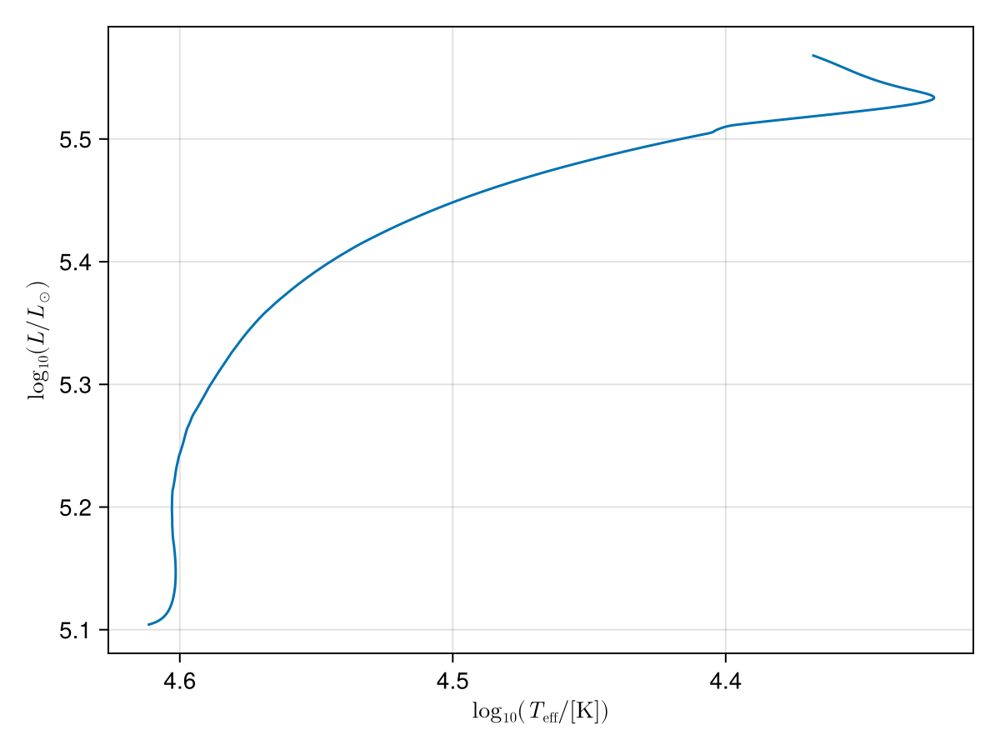
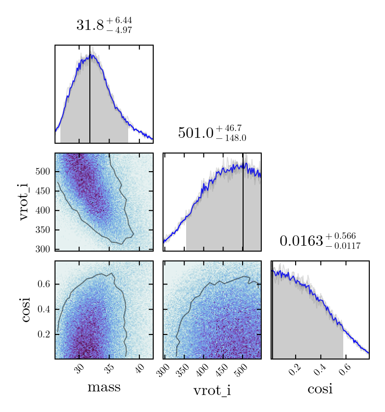
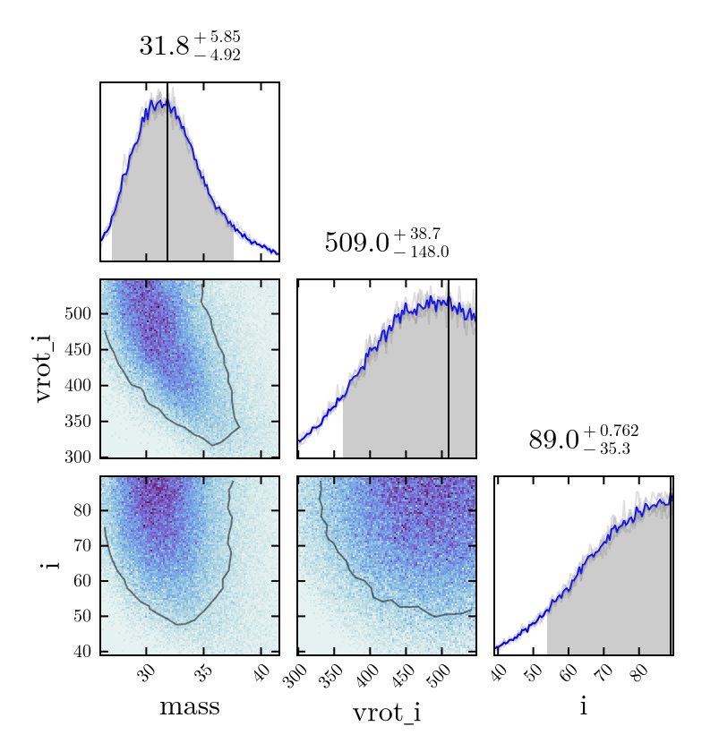

# StarStats.jl

This package is designed to read grids of stellar evolution models from different evolutionary codes and perform interpolation and Bayesian inference against observed systems.

The following code  block shows an example of loading a grid with two variable parameters

* masses: sampled linearly $M/M_{\odot}=20-60$ in steps of $2M_{\odot}$
* rotation:  $v/[\mathrm{km\,s^{-1}}]=0-550$ sampled linearly in steps of $50\,[\mathrm{km\,s^{-1}}]$

The function `path_constructor` defines the location of each simulation based on the input parameters. In this case we use data from MESA, for which there is a built-in
function to read history.data files

```julia
using StarStats

# load up simulation grid
function path_constructor(strings::Vector{String})
    # this tells me how to construct a path to the data from the simulation input
    # it assumes files are at ./MODELS/LOGS_<MASS>_<ROTATION>/history.data
    return "./MODELS/LOGS_$(strings[1])_$(strings[2])/history.data"
end
masses = ["$(x)" for x in 20:2:60]
rotation = ["$(x)" for x in 0:50:550]
star_grid = ModelDataGrid([masses, rotation],[:mass,:rotation])
load_grid(star_grid,path_constructor,StarStats.mesa_dataframe_loader); 
compute_distances_and_EEPs(star_grid)
```

After loading the grid one can perform interpolations to produce a grid at arbitrary input values. See example below, the evolutionary stage is taken from the quantity
$x$, which is zero at ZAMS, 1 at the intermediate main sequence and 2 at TAMS. This
is based on the equivalent evolutionary points described by [Dotter et al. (2016)](https://ui.adsabs.harvard.edu/abs/2016ApJS..222....8D/abstract)

```julia
# plot an example interpolated track
using LaTeXStrings, CairoMakie
xvals = LinRange(0,2.0, 1000)
rotation = 450.0
mass = 32.0
logTeff = interpolate_grid_quantity.(Ref(star_grid),Ref([mass, rotation]),:logTeff, xvals)
logL = interpolate_grid_quantity.(Ref(star_grid),Ref([mass, rotation]),:logL, xvals)
f = Figure()
ax = Axis(f[1,1], ylabel=L"\log_{10}(L/L_\odot)", xlabel=L"\log_{10}(T_\mathrm{eff}/[\mathrm{K}])", xreversed=true)
lines!(logTeff, logL)
save("HR.png", f)
f
```



Using the loaded grid one can perform Bayesian inference of initial parameters of an observed star. We use the `Turing` package to perform an MCMC   for a given  observed values of a star. Below we construct the model that receives values for effective temperature, luminosity and rotation with their corresponding errors.

```julia
# create an MCMC model for an observation with Teff, logL and vrot
using Turing, Distributions
@model function star_model(logTeff_obs, logTeff_err, logL_obs, logL_err, vrot_obs, vrot_err, star_grid)
  x ~ Uniform(0,2)
  mass ~ Uniform(20,60)
  vrot_i ~ Uniform(0,550)
  cosi ~ Uniform(0,1)
  i = acos(cosi)
  logTeff = interpolate_grid_quantity(star_grid,[mass, vrot_i],:logTeff,x)
  logL = interpolate_grid_quantity(star_grid,[mass, vrot_i],:logL,x)
  vrot = interpolate_grid_quantity(star_grid,[mass, vrot_i],:surf_avg_v_rot,x)
  vsini = vrot*sin(i)
  logTeff_obs ~ Normal(logTeff, logTeff_err)
  logL_obs ~ Normal(logL, logL_err)
  vrot_obs ~ Normal(vsini, vrot_err)
end
```

With this model so defined we run four independent MCMC chains using the NUTS algorithm.

```julia
num_chains=4
observed_star_model = star_model(4.5, 0.05, 5.4, 0.05, 250.0, 10.0, star_grid)
chains = sample(observed_star_model, NUTS(500,0.9), MCMCThreads(), 20000, 4)
```

One can  construct the corner plot and obtain the credible intervals for the initial parameters using the `CornerPlotting.jl` package.

```julia
# Show the raw results
using CornerPlotting
set_theme!(CornerPlotting.default_theme())
corner_plot = CornerPlotting.CornerPlot(chains,[:mass, :vrot_i, :cosi])
save("corner_plot1.png", corner_plot.fig)
corner_plot.figusing Makie
figure = get_star_corner_plot(star_grid,star_chains)
save("corner_plot.png",figure)
```



In practice, we need to properly weight things. Above example is sampled uniformly
in mass and in the evolutionary property x, which is not linear with time.
We can correct this by creating a weights array

```julia
weights = zeros(size(chains[:mass]))
for i in eachindex(weights)
    mass = chains[:mass][i]
    rotation = chains[:vrot_i][i]
    x = chains[:x][i]
    dtdx = interpolate_grid_quantity(star_grid,[mass, rotation],:dtdx,x)
    weights[i] = dtdx*mass^(-2.3) # Salpeter IMF
end
# we create a results dictionary with the weights, and do a corner plot
results = Dict(
    :mass => chains[:mass],
    :vrot_i => chains[:vrot_i],
    :i => acos.(chains[:cosi]) .* 180 ./ pi,
    :weights => weights
)
corner_plot = CornerPlotting.CornerPlot(results,[:mass, :vrot_i, :i])
save("corner_plot2.png", corner_plot.fig)
corner_plot.fig
```

