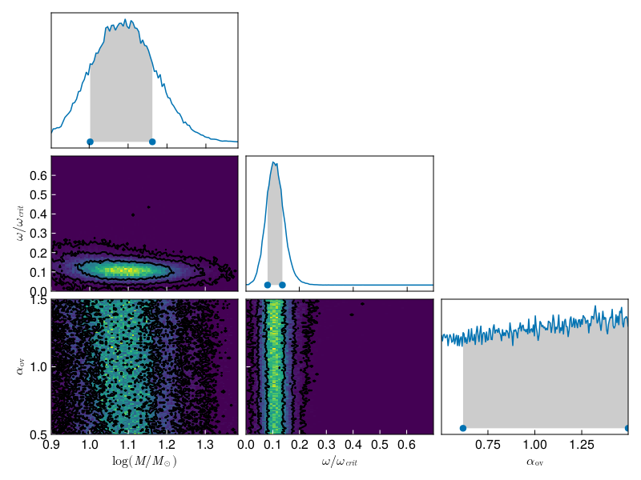

# StarStats.jl

This package is designed to read grids of stellar evolution models from different evolutionary codes and perform interpolation and Bayesian inference against observed systems.

The following code  block shows an example of loading a grid with three variable parameters

* masses: sampled logarithmically log M/M$_{\odot}$=0.9-2.1 in steps of 0.025
* rotation:  omega/omega$_{crit}$=0.0-0.9 sampled linearly in steps of 0.1
* overshoot:  step overshooting parameter $\alpha_{overshoot}/0.335$=0.5-4.5 in steps of 0.5

The function `path_constructor` defines the location of each simulation based on the input parameters.

```julia
using StarStats
using Printf

function path_constructor(strings::Vector{String})
    DATA_FOLDER = ENV["STARSTATS_TEST_DATA_FOLDER"]
    return DATA_FOLDER*"/LMC/LMC_$(strings[1])_$(strings[2])_$(strings[3]).track.gz"
end
masses = [@sprintf("%.3f", x) for x in range(0.9,2.1,step=0.025)]
rotation = [@sprintf("%.2f", x) for x in range(0.0,0.9,step=0.1)]
overshoot = [@sprintf("%.2f
", x) for x in range(0.5,4.5,step=0.5)]

star_grid = ModelDataGrid([rotation,masses,overshoot],[:rotation,:logM,:overshoot])
load_grid(star_grid,path_constructor,gz_dataframe_loader_with_Teff_and_star_age_fix); 
compute_distances_and_EEPs(grid)
```

After loading the grid one can perform interpolations to produce a grid at arbitrary input values. See example below

```julia
using LaTeXStrings
using Plots
plot(legend=false,
xflip=true, 
xlabel=L"log (T$_{eff}$/K)",
ylabel=L"log (L/L$_{\odot}$)")

xvals = LinRange(0,5, 1000)
rotation = 0.13
logM = 1.21
overshoot = 1.05
logTeff = interpolate_grid_quantity.(Ref(grid),Ref([rotation,logM,overshoot]),:logTeff, xvals)
logL = interpolate_grid_quantity.(Ref(grid),Ref([0.13,1.21,1.05]),:logL, xvals)

plot!(logTeff, logL)
savefig("HR.png")
```


Using the loaded grid one can perform Bayesian inference of initial parameters of an observed star.

We use the `Turing` package to perform an MCMC   for a given  observed values of a star. Below we construct the model that receives values for effective temperature, luminosity and rotation with their corresponding errors.

```julia
using Turing, Distributions

@model function star_model(logTeff_obs, logTeff_err, logL_obs, logL_err, vrot_obs, vrot_err, star_grid)
  x ~ Uniform(0,3)
  logM ~ Uniform(0.9, 1.5)
  rotation ~ Uniform(0,0.9)
  overshoot ~ Uniform(0.5,1.5)
  logTeff = interpolate_grid_quantity(star_grid,[rotation, logM, overshoot],:logTeff,x)
  logL = interpolate_grid_quantity(star_grid,[rotation, logM, overshoot],:logL,x)
  vrot = interpolate_grid_quantity(star_grid,[rotation, logM, overshoot],:vrot,x)
  logTeff_obs ~ Normal(logTeff, logTeff_err)
  logL_obs ~ Normal(logL, logL_err)
  vrot_obs ~ Normal(vrot, vrot_err)
  return logTeff_obs, logL_obs, vrot_obs
end
```

With this model so defined we run four independent MCMC chains using the NUTS algorithm.

```julia
using Logging
Logging.disable_logging(Logging.Warn)
## Here needs more analysis for optimization
num_chains=4

observed_star_model = star_model(4.51974, 0.2, 4.289877, 0.2, 70.7195, 20, star_grid)
star_chains = mapreduce(c -> sample(observed_star_model, NUTS(500,0.9), 20000;stream=false, progress=true), chainscat, 1:num_chains)
```

One can  construct the corner plot and obtain the credible intervals for the initial parameters using the `get_star_corner_plot` function.

```julia
using Makie
figure = get_star_corner_plot(star_grid,star_chains)
save("corner_plot.png",figure)```
```





